인공지능으로 인한 일자리 변화에 대한 인식조사
================

------------------------------------------------------------------------

60140680 권용우 60140609 김영빈 60160583 반영은 60170471 이의정

1. 요약
-------

#### '인공지능에 대한 인식도', '인간의 일자리에 대한 인공지능의 위협도', '본인의 일자리에 대한 인공지능의 위협도', '인공지능에 따른 새로운 일자리 창출', '일자리에 대한 인공지능의 잠재적 영향력'에 대한 질문에 대해 '성별, 연령, 직업, 소득, 지역' 별로 분석하였다. 성별 부분에서는 5가지 질문에 대해 비슷한 인식을 하는 것으로 조사되었다. 특이한 점으로 여성이 남성보다 인공지능에 대해 긍정적으로 인식하는 것으로 분석되었다. 이는 여성은 로봇 청소기와 같이 인공지능에 따른 생활의 편리함에 대해 긍정적으로 인식하는 것으로 추론할 수 있다. 연령 부분에서도 크게 차이점은 없었지만, 연령층이 젊어질수록 상대적으로 인공지능에 대해 긍정적으로 인식하였고, 인공지능이 우리의 일자리에 대해 위협 도가 더 높다는 대답을 한 것으로 분석되었다. 이는 젊은 연령층은 인공지능이 미래 자신의 취업을 위협할 수 있으므로 이러한 답변을 한 것으로 추론할 수 있다. 직업 부분에서는 모든 직업이 인공지능에 대해 부정적으로 인식하는 것으로 조사되었고, 인간의 일자리 위협 도에 대해선 대체로 동의한다는 의견이 많았지만, 자신의 일자리는 안전할 것으로 생각하는 것으로 분석되었다. 특히 육체적 노동을 하는 장치, 기계조작 및 조립 종사자는 상대적으로 자신의 직업이 위협당할 것으로 인식하였다. 이러한 결과는 국민들이 인공지능이 지식 서비스업보다는 사람의 육체적 노동이 필요한 직업을 우선으로 대체할 것으로 전망하고 있다는 점을 보여주고 있다. 소득별 부분에서는 '인간의 일자리를 빼앗을 것이다', '나의 일은 위협을 받지 않을 것이다.' '새롭게 생겨날 직업도 많을 것이다'의 항목에 대하여 대체로 저소득층으로 갈수록 부정적인 답변의 비율이 높게 나오는 비슷한 패턴을 볼 수 있었다. 일반적으로 저소득층일수록 인공지능이 생계와 직결된, 일자리를 대체한다는 것에 대해 더욱더 민감하게 반응을 하는 것으로 보인다. 종합적으로 국민들은 인공지능에 대해 과반수가 부정적으로 인식하는 것으로 나타났다. 인공지능에 따른 인간의 일자리 위협에 대해선 동의하지만, 자신의 일자리 위협에 대해선 동의하지 않은 것으로 나타났다. 이는 국민들은 기술 발전으로 인해 일자리가 사라질 수는 있지만 근본적으로 창조력이나 상상력이 요구되는 인간 고유의 행위 혹은 일자리는 대체할 수 없을 것이라는 생각을 갖고 있다고 추론할 수 있다. 즉, 인공지능, 로봇 등 신기술의 일상화에 대해 일자리에 대한 위협으로 받아들이기보다는 오히려 그것이 가져다 줄 수 있는 어떤 새로운 혜택에 대한 기대감을 나타내고 있다고도 분석할 수 있다. 또한, 인공지능으로 인한 새로운 일자리 창출에 대해 동의하며, 인공지능이 인간의 일자리에 대한 잠재적 영향력에 대해 일자리 수가 감소하지만, 적응할 것이라는 대답을 한 것으로 분석되었다. 이는 국민들은 로봇 등 신기술로 인한 새로운 기회에 대해 긍정적으로 인식하고 있음을 알 수 있다.

2. 분석 주제
------------

#### 4차 산업혁명을 맞아 공장의 자동화 기계, 인간형 로봇, 알고리즘, 소프트웨어, 기계 학습 등을 통해 전통적으로 사람이 수행하던 일을 자동으로 보완하거나 대체하는 경우가 많아지고 있다. 로봇의 발달로 인해 5년 뒤에는 약 700만개 이상의 일자리가 사라질 것이라는 전망과 함께 그 중 사무 및 관리직이 약 476만개로 중산층 중심의 대량 실업난을 예고하는 연구 보고서가 있을 정도입니다.(출처 : 2016 다보스 포럼 보고서) 이러한 흥미로운 연구 보고서를 통해 과연 우리나라에서는 로봇에 대한 인식이 어떠한지, 4차 산업 혁명을 맞이하여 일자리에 대한 관심이 높아지고 있는 현실에서 로봇이 유입됨으로서 어떤 영향을 미칠지 연구하고자 한다. 앞으로 다가올 인공지능과 미래 기술 시대에 대한 시민들의 인식 차이를 특히 '성별, 연령, 직업, 소득, 지역' 별로 조사하고자 한다.

3. 데이터 선정
--------------

### 데이터 선정 이유

#### 4차산업 혁명으로 인해 인공지능이 인간의 일자리를 대체하고 있으며, 그에 따라 새로운 일자리가 생겨나고 있다. 프레이와 오스본(Frey & Osborne, 2013)1), 세계경제포럼(World Economic Forum, 2016) World EconomicForum(2016)2), 취와 동료들(Chui et al., 2016)3) 등의 선행 연구에 따르면 디지털화나 인공지능을 비롯한 신기술은 인간의 일자리를 상당 수준 대체할 것이라고 예측하였다. 이에 따라 과연 시민들의 인공지능에 따른 일자리에 대한 인식도를 조사하여 우리나라에서의 인식도 앞의 연구결과와 같은 방향으로 분석되는지 알고자 분석 하였다. 또한 앞으로 우리가 4차산업 혁명에 따른 일자리 변화에 대해 어떻게 대비해야 하는지 참고할 수 있는 데이터가 될 수 있다. 한국언론진흥재단 미디어 연구센터는 성인남녀 1,038명을 대상으로 로봇이 인간의 일자리를 얼마나 위협하는지 온라인 설문조사를 했다. 이 데이터는 인공지능, 자동화, 로봇 등 최신 기술의 영향에 관해 전문가 아닌 일반 국민이 어떻게 생각하고 있는지를 조사했다는 점에서 향후 관련 일자리에 관한 기술과 개발 적용에 기초자료로 활용될 수 있을 것이다. 이러한 이유로 이 데이터를 선정하였다.

### 출처

#### 한국언론진흥재단-[2016년 2권 2호 - 진격하는 로봇 : 인간의 일자리를 얼마나 위협할까](http://www.kpf.or.kr/site/kpf/ex/board/View.do?cbIdx=292&bcIdx=17940)

### 특성,구성

#### 본 데이터는 성인남녀 1,038명을 대상으로 로봇이 인간의 일자리를 얼마나 위협하는지에 대해 2016년 2월에 온라인 설문조사를 한 결과이다. 남성이 50.6%, 여성이 49.4%, 20대 25.4%, 30대 25%, 40대 24.4%, 50대 25.1%로, 성별·연령대별로 비교적 고른 분포를 보인다.

#### 4-1. 데이터 전처리

``` r
#패키지준비
library(ggplot2)
library(dplyr)
library(gridExtra)
library(readxl)

#데이터 불러들이기
raw_data <- read.csv("robot.csv")

# 데이터 복사본 만들기
data <- raw_data
```

``` r
#데이터 형태 확인
str(raw_data)
summary(raw_data)
head(raw_data)
```

``` r
#결측치 확인
table(!is.na(data)) #전체 데이터에는 432개의 결측치 존재

#분석에 사용할 데이터의 결측치 확인
table(!is.na(data$SQ1))
table(!is.na(data$SQ2))
table(!is.na(data$DQ3))
table(!is.na(data$DQ4))
table(!is.na(data$Q3))
table(!is.na(data$Q4_2))
table(!is.na(data$Q4_7))
table(!is.na(data$Q4_8))
table(!is.na(data$Q9))
```

``` r
# 필요 데이터 추출
df <- data %>% 
  select(id, SQ1, SQ2, DQ1, DQ3, DQ4, Q3, Q4_2, Q4_7, Q4_8, Q9)

# 변수명 바꾸기
df <- rename(df,
               ages = SQ1,                  # 연령대
               sex = SQ2,                   # 성별
               giograph=DQ1,                # 지역
               job = DQ3,                   # 직업별
               income = DQ4,                # 소득
               prefer = Q3,                 # 평소 인공지능에 대한 인식정도
               take_job = Q4_2,             # 인공지능이 인간의 일자리를 뺏을 것이라는 생각
               threat_job = Q4_7,           # 인공지능이 나의 일자리를 위협할 것이라는 생각
               new_job = Q4_8,              # 인공지능으로 인해 새로운 일자리가 생길 것이라는 생각
               influence = Q9)              # 인공지능이 미래 일자리에 미칠 잠재적 영향력
```

#### 4-2. 성별에 따른 인공지능

##### 1. 성별에 따른 인공지능 인식도

###### 1-1.데이터 전처리

``` r
# recognition(Q3) 이름부여
df$prefer <- ifelse(df$prefer==1,"긍정적",
                           ifelse(df$prefer==2,"긍정적",
                                 ifelse(df$prefer==3,"부정적", "부정적")))
```

###### 1-2. 데이터 가공

``` r
#데이터 가공
m_prefer <- df %>% 
  filter(sex==1) %>% 
  group_by(prefer) %>% 
  summarise(n=n())

f_prefer <- df %>% 
  filter(sex==2) %>% 
  group_by(prefer) %>% 
  summarise(n=n())

m_prefer$sex <- ifelse(m_prefer$n > 0, "male", NA)
f_prefer$sex <- ifelse(f_prefer$n > 0, "female", NA)

total_prefer <- bind_rows(m_prefer,f_prefer)
```

###### 1-4. 성별에 따른 인공지능에 대한 인식도 그래프

``` r
#데이터 시각화
ggplot(data = total_prefer, aes(x=prefer, y=n, fill = sex)) + geom_col(position = "dodge") + coord_flip() + ggtitle("인공지능에 대한 성별간 우호도")+
  theme(legend.position = "bottom")
```


##### 남성과 여성 모두 인공지능에 대해 부정적으로 인식하는 것으로 나타났다. 좀 더 세부적으로 보면, 남성이 여성보다 인공지능에 대해 좀 더 부정적으로 인식하고, 여성이 남성보다 다소 긍정적으로 인식한다.

##### 2. 성별에 따른 인공지능 위협도 인식 (인간의 일자리)

###### 2-1. 데이터 전처리

``` r
#take_job(Q4_2)이름부여
df$take_job <- ifelse(df$take_job==1,"거의 동의 안함",
                      ifelse(df$take_job==2,"대체로 동의 안함",
                             ifelse(df$take_job==3,"대체로 동의함", "매우 동의함")))
```

###### 2-2. 남성

``` r
#데이터 가공
m_take <- df %>% 
  filter(sex == 1) %>% 
  group_by(take_job) %>% 
  summarise(n = n())

#데이터 시각화
ggplot(data = m_take, aes(x=take_job, y=n)) + geom_col() + coord_flip()+
  ggtitle("인간의 일자리에 대한 인공지능의 위협도_남성")
```

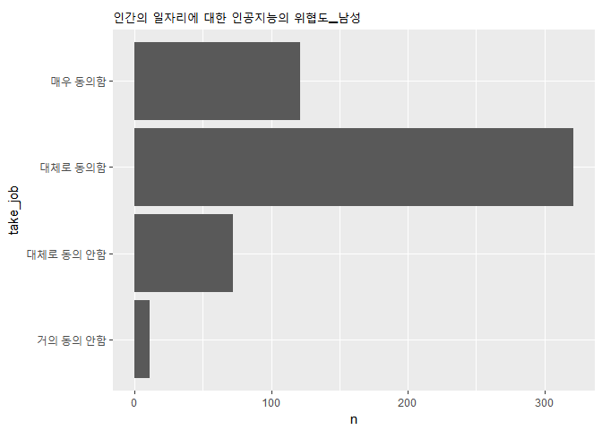

###### 2-3. 여성

``` r
#데이터 가공
f_take <- df %>% 
  filter(sex == 2) %>% 
  group_by(take_job) %>% 
  summarise(n = n())

#데이터 시각화
ggplot(data = f_take, aes(x=take_job, y=n)) + geom_col() + coord_flip()+
  ggtitle("인간의 일자리에 대한 인공지능의 위협도_여성")
```


###### 2-4. 성별에 따른 인공지능의 위협도 인식 종합 (인간의 일자리)

``` r
#데이터 가공
m_take$sex <- ifelse(m_take$n > 0, "male", NA)
f_take$sex <- ifelse(f_take$n > 0, "female", NA)

total_take <- bind_rows(m_take,f_take)

#데이터 시각화
ggplot(data = total_take, aes(x=take_job, y=n, fill = sex)) + geom_col(position = "dodge") + coord_flip()+
  ggtitle("'인간의 일자리를 빼앗을 것이다'라는 질문에 대한 성별간 응답")+
  theme(legend.position = "bottom")+
  scale_fill_discrete(name="성별", labels=c("여성","남성"))
```

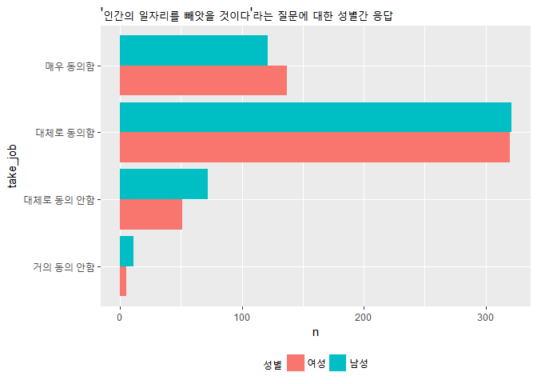

##### 남성과 여성 모두 인공지능에 따른 인간의 일자리 위협에 대해 대체로 동의한다는 대답을 하였다.

##### 3. 성별에 따른 인공지능 위협도 인식 (본인의 일자리)

###### 3-1. 데이터 전처리

``` r
# threat_job(Q4_7) 이름부여
df$threat_job <- ifelse(df$threat_job==1,"거의 동의 안함",
                      ifelse(df$threat_job==2,"대체로 동의 안함",
                             ifelse(df$threat_job==3,"대체로 동의함", "매우 동의함")))
```

###### 3-2. 남성

``` r
#데이터 가공
m_threat <- df %>% 
  filter(sex==1) %>% 
  group_by(threat_job) %>% 
  summarise(n=n())

#데이터 시각화
ggplot(data = m_threat, aes(x=threat_job, y=n)) + geom_col() + coord_flip()+
  ggtitle("인공지능이 자신의 일자리에 대한 위협도_남성")
```


###### 3-3. 여성

``` r
#데이터 가공
f_threat <- df %>% 
  filter(sex==2) %>% 
  group_by(threat_job) %>% 
  summarise(n=n())

#데이터 시각화
ggplot(data = f_threat, aes(x=threat_job, y=n)) + geom_col() + coord_flip()+
  ggtitle("인공지능이 자신의 일자리에 대한 위협도_여성")
```

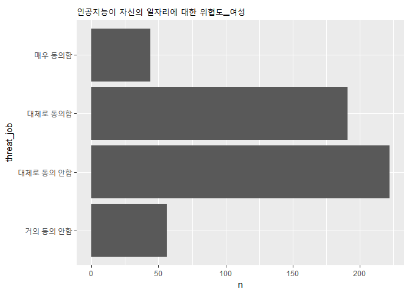

###### 3-4. 성별에 따른 인공지능 위협도 인식 종합 (본인의 일자리)

``` r
#데이터 가공
m_threat$sex <- ifelse(m_threat$n > 0, "male", NA)
f_threat$sex <- ifelse(f_threat$n > 0, "female", NA)

total_threat <- bind_rows(m_threat,f_threat)

#데이터 시각화
ggplot(data = total_threat, aes(x=threat_job, y=n, fill = sex)) + geom_col(position = "dodge") + coord_flip()+
  ggtitle("내가 현재 하고 있는 일은 위협을 받지 않을 것이다 성별간 응답")+
  theme(legend.position = "bottom")
```


##### 남성과 여성 모두 인공지능이 자신의 일자리를 위협하지 않을 것이라는 질문에 거의 동의하지 않는다고 대답하였다. 하지만 인간의 일자리를 위협할 것이라는 질문에 대해 동의한다는 의견을 한 것과는 다르게 자신의 일자리를 위협하지 않을 것이라고 답한 빈도가 높은 것으로 나타났다.

##### 4. 성별에 따른 인공지능의 새로운 일자리 창출에대한 인식

###### 4-1. 데이터 전처리

``` r
# new_job(Q4_8)이름부여
df$new_job <- ifelse(df$new_job==1,"거의 동의 안함",
                       ifelse(df$new_job==2,"대체로 동의 안함",
                              ifelse(df$new_job==3,"대체로 동의함", "매우 동의함")))
```

###### 4-2. 남성

``` r
#데이터 가공
m_new_job <- df %>% 
  filter(sex==1) %>% 
  group_by(new_job) %>% 
  summarise(n=n())

#데이터 시각화
ggplot(data = m_new_job, aes(x=new_job, y=n)) + geom_col() + coord_flip()+
  ggtitle("인공지능에 따른 새로운 일자리_남성")
```


###### 4-3. 여성

``` r
#데이터 가공
f_new_job <- df %>% 
  filter(sex==2) %>%
  group_by(new_job) %>% 
  summarise(n=n())

#데이터 시각화
ggplot(data = f_new_job, aes(x=new_job, y=n)) + geom_col() + coord_flip()+
  ggtitle("인공지능에 따른 새로운 일자리_여성")
```


###### 4-4. 인공지능에 따른 일자리 창출\_ 종합

``` r
m_new_job$sex <- ifelse(m_new_job$n > 0, "male", NA)
f_new_job$sex <- ifelse(f_new_job$n > 0, "female", NA)

total_new_job <- bind_rows(m_new_job,f_new_job)

ggplot(data = total_new_job, aes(x=new_job, y=n, fill = sex)) + geom_col(position = "dodge") + coord_flip()+
  ggtitle("사라지는 직업만큼 새롭게 생겨날 직업도 많을 것이다 성별간 응답")+
  theme(legend.position = "bottom")
```


##### 남성과 여성 모두 '사라지는 직업만큼 새롭게 생겨날 직업/일자리도 많을 것이다.'라는 질문에 대체로 동의한다는 대답을 하였다.

##### 5. 성별에 따른 일자리에 대한 인공지능의 잠재적 영향력

###### 5-1. 데이터 전처리

``` r
#influence(Q9) 이름 부여
df$influence <- ifelse(df$influence==1,"궁극적 증가",
                         ifelse(df$influence==2,"단기적 감소, 장기적 증가",
                                ifelse(df$influence==3,"감소하나 적응",
                                       ifelse(df$influence==4, "감소로 인한 폭동" , "모르겠다")))) 
```

###### 5-2. 남성

``` r
#데이터 가공
m_influence <- df %>% 
  filter(sex==1) %>% 
  group_by(influence) %>% 
  summarise(n=n())

#데이터 시각화
ggplot(data = m_influence, aes(x=influence, y=n)) + geom_col() + coord_flip()+
  ggtitle("인공지능이 일자리에 대한 잠재적 영향력_남성")
```

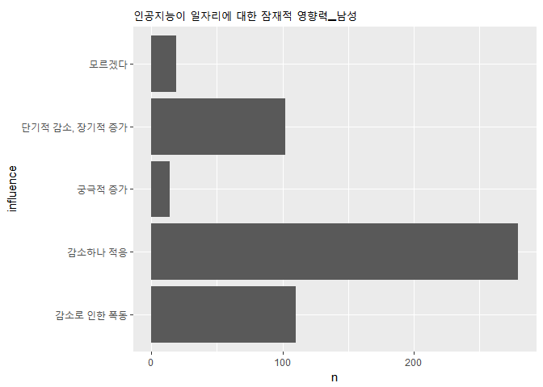 \#\#\#\#\#\# 5-3. 여성

``` r
#데이터 가공
f_influence <- df %>% 
  filter(sex==2) %>% 
  group_by(influence) %>% 
  summarise(n=n())

#데이터 시각화
ggplot(data = f_influence, aes(x=influence, y=n)) + geom_col() + coord_flip()+
  ggtitle("인공지능이 일자리에 대한 잠재적 영향력_여성")
```


###### 5-4. 일자리에 대한 인공지능의 잠재적 영향력\_종합

``` r
# 데이터 가공
m_influence$sex <- ifelse(m_influence$n > 0, "male", NA)
f_influence$sex <- ifelse(f_influence$n > 0, "female", NA)

total_influence <- bind_rows(m_influence,f_influence)

#데이터 시각화
ggplot(data = total_influence, aes(x=influence, y=n, fill = sex)) +
  geom_col(position = "dodge") + coord_flip()+
  theme(legend.position = "bottom")+
  ggtitle("인공지능이 일자리에 미치는 잠재적 영향 성별간 응답")
```

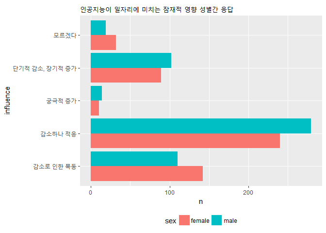

##### 남성과 여성 모두 인공지능으로 인해 일자리 수가 감소하지만 사회적으로는 적응할 것이라는 대답이 가장 많았다. 세부적으로 살펴보면, 남성이 사회적으로 적응할 것이라는 대답을 여성보다 더 많이 한 것으로 분석되었고, 여성이 상대적으로 사회적 폭동을 우려하는 것으로 나타났다.

#### 4-3. 연령에 따른 차이

##### 1. 연령별 인공지능 인식도

``` r
# 데이터 가공 
# 연령별 미래기술 우호정도 수치 확인

df %>% filter(ages == 1) %>%     # 20대가 생각하는 위험도
  group_by(prefer) %>% 
  summarise(count = n())
```

    ## # A tibble: 2 x 2
    ##   prefer count
    ##   <chr>  <int>
    ## 1 긍정적    48
    ## 2 부정적   216

``` r
df %>% filter(ages == 2) %>%     # 30대가 생각하는 위험도
  group_by(prefer) %>% 
  summarise(count = n())
```

    ## # A tibble: 2 x 2
    ##   prefer count
    ##   <chr>  <int>
    ## 1 긍정적    44
    ## 2 부정적   216

``` r
df %>% filter(ages == 3) %>%     # 40대가 생각하는 위험도
  group_by(prefer) %>% 
  summarise(count = n())
```

    ## # A tibble: 2 x 2
    ##   prefer count
    ##   <chr>  <int>
    ## 1 긍정적    34
    ## 2 부정적   219

``` r
df %>% filter(ages == 4) %>%     # 50대가 생각하는 위험도
  group_by(prefer) %>% 
  summarise(count = n())
```

    ## # A tibble: 2 x 2
    ##   prefer count
    ##   <chr>  <int>
    ## 1 긍정적    27
    ## 2 부정적   234

``` r
# 시각화 전처리
df <- df %>% mutate(n_ages = ifelse(ages == 1, "20's",
                                    ifelse(ages == 2, "30's",
                                           ifelse(ages == 3, "40's", "50's"))))

df_prefer <- df %>% group_by(n_ages, prefer) %>%
  summarise(count = n())
df_prefer
```

    ## # A tibble: 8 x 3
    ## # Groups:   n_ages [?]
    ##   n_ages prefer count
    ##   <chr>  <chr>  <int>
    ## 1 20's   긍정적    48
    ## 2 20's   부정적   216
    ## 3 30's   긍정적    44
    ## 4 30's   부정적   216
    ## 5 40's   긍정적    34
    ## 6 40's   부정적   219
    ## 7 50's   긍정적    27
    ## 8 50's   부정적   234

``` r
# 시각화
ggplot(data = df_prefer, aes(x = prefer, y = count, fill = n_ages)) + 
  geom_col(position = "dodge") + 
  scale_x_discrete(limits=c("긍정적","부정적")) +
  scale_fill_discrete(name="연령대")+
  coord_flip()+
  ggtitle("인공지능에 대한 연령별 우호도")
```


##### 위 그래프를 통해 연령별로 모두 미래기술에 대해서 다소 부정적 인식을 하고 있음을 알 수 있었다. 특이한 점으로는 연령층이 젊어질수록 미래기술에 대한 긍정적 인식이 상대적으로 높아짐을 확인할 수 있으며, 50대의 경우 미래기술에 매우 부정적 인식을 하고 있음을 알 수 있었다.

##### 2. 연령대별 인공지능 위협도 인식 (인간의 일자리)

``` r
# 데이터 확인
df %>% group_by(n_ages, take_job) %>%    #일자리를 뺏을 것이라는 생각
  summarise(count = n())
```

    ## # A tibble: 16 x 3
    ## # Groups:   n_ages [?]
    ##    n_ages take_job         count
    ##    <chr>  <chr>            <int>
    ##  1 20's   거의 동의 안함       7
    ##  2 20's   대체로 동의 안함    27
    ##  3 20's   대체로 동의함      158
    ##  4 20's   매우 동의함         72
    ##  5 30's   거의 동의 안함       6
    ##  6 30's   대체로 동의 안함    29
    ##  7 30's   대체로 동의함      163
    ##  8 30's   매우 동의함         62
    ##  9 40's   거의 동의 안함       2
    ## 10 40's   대체로 동의 안함    30
    ## 11 40's   대체로 동의함      161
    ## 12 40's   매우 동의함         60
    ## 13 50's   거의 동의 안함       1
    ## 14 50's   대체로 동의 안함    37
    ## 15 50's   대체로 동의함      159
    ## 16 50's   매우 동의함         64

``` r
# 데이터 가공
# 시각화 준비
df_take_job <- df %>% group_by(n_ages, take_job) %>%    
  summarise(count = n())%>% 
  mutate(ratio = count/sum(count)*100)

#데이터 시각화
ggplot(data = df_take_job, aes(x = take_job, y = ratio, fill = n_ages)) + 
  geom_col (position = "dodge") + 
  coord_flip()+
  scale_fill_discrete(name="연령대")+
  ggtitle("인공지능이 인간의 일자리를 뺏을 것이다 연령별 응답")
```

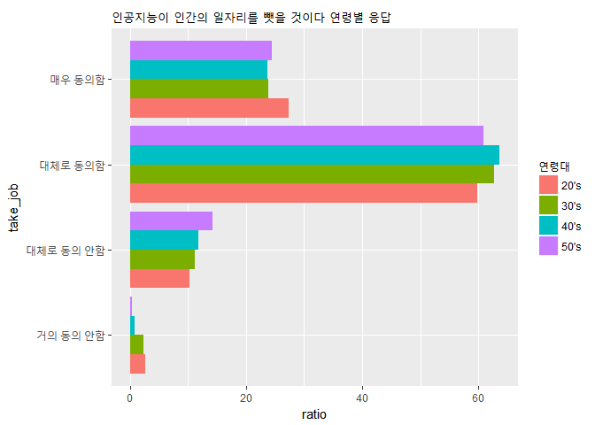

##### 미래 기술이 일자리를 뺏을 것으로 생각하느냐는 질문에 대부분의 연령대에서 질문에 동의한다고 응답했다. 주목할 만한 점으로는 질문에 거의 동의하지 않는다고 응답한 연령대는 20대가 가장 낮았고, 50대가 가장 높았다. 미래 기술에 친숙하다고 느끼는 20대가 오히려 미래기술로 인해 인간의 일자리가 빼앗길 것이라고 가장 많이 생각하는 것이다.

##### 3. 연령대별 인공지능 위협도 인식 (본인의 일자리)

``` r
# 데이터 확인
df %>% group_by(n_ages, threat_job) %>%       #지금 일이 미래에 위협받을 것이라는 생각
  summarise(count = n())
```

    ## # A tibble: 16 x 3
    ## # Groups:   n_ages [?]
    ##    n_ages threat_job       count
    ##    <chr>  <chr>            <int>
    ##  1 20's   거의 동의 안함      29
    ##  2 20's   대체로 동의 안함   106
    ##  3 20's   대체로 동의함      100
    ##  4 20's   매우 동의함         29
    ##  5 30's   거의 동의 안함      27
    ##  6 30's   대체로 동의 안함   104
    ##  7 30's   대체로 동의함      102
    ##  8 30's   매우 동의함         27
    ##  9 40's   거의 동의 안함      27
    ## 10 40's   대체로 동의 안함   117
    ## 11 40's   대체로 동의함       87
    ## 12 40's   매우 동의함         22
    ## 13 50's   거의 동의 안함      21
    ## 14 50's   대체로 동의 안함   111
    ## 15 50's   대체로 동의함       98
    ## 16 50's   매우 동의함         31

``` r
# 데이터 가공
# 시각화 준비
df_threat <- df %>% group_by(n_ages, threat_job) %>%     
  summarise(count = n()) %>% 
  mutate(ratio = count/sum(count)*100)
  

# 데이터 시각화
ggplot(data = df_threat, aes(x = threat_job, y = ratio, fill = n_ages)) + 
  geom_col(position = "dodge") + 
  scale_fill_discrete(name="연령대")+
  coord_flip()+
  ggtitle("내가 현재 하고 있는 직업은 위협받지 않을 것이다 연령별 응답")
```

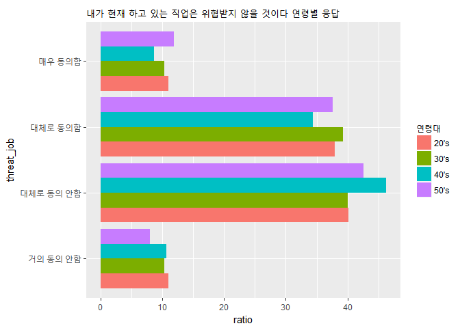

##### 미래기술로 인해서 자신의 일자리가 위협받을 것 같으냐는 질문에는 크게 거의 동의한다고 말한 측과 대체로 동의한다고 말하는 측으로 갈렸다. 여기서 역시 주목할 만한 점은 지금의 일자리가 미래기술에 위협받지 않을 것으로 생각하는 연령대가 40대가 가장 많다는 것이다.

##### 4. 연령대별 인공지능의 새로운 일자리 창출에 대한 인식

``` r
# 데이터 확인
df %>% group_by(n_ages, new_job) %>%       #새로운 일자리가 생길 것이라는 생각
  summarise(count = n())
```

    ## # A tibble: 16 x 3
    ## # Groups:   n_ages [?]
    ##    n_ages new_job          count
    ##    <chr>  <chr>            <int>
    ##  1 20's   거의 동의 안함      14
    ##  2 20's   대체로 동의 안함    89
    ##  3 20's   대체로 동의함      124
    ##  4 20's   매우 동의함         37
    ##  5 30's   거의 동의 안함      10
    ##  6 30's   대체로 동의 안함    84
    ##  7 30's   대체로 동의함      136
    ##  8 30's   매우 동의함         30
    ##  9 40's   거의 동의 안함      11
    ## 10 40's   대체로 동의 안함    63
    ## 11 40's   대체로 동의함      152
    ## 12 40's   매우 동의함         27
    ## 13 50's   거의 동의 안함       8
    ## 14 50's   대체로 동의 안함    65
    ## 15 50's   대체로 동의함      158
    ## 16 50's   매우 동의함         30

``` r
# 데이터 가공
# 시각화 준비
df_new_job <- df %>% group_by(n_ages, new_job) %>%    
  summarise(count = n())%>% 
  mutate(ratio = count/sum(count)*100)

# 데이터 시각화
ggplot(data = df_new_job, aes(x = new_job, y = ratio, fill = n_ages)) + 
  geom_col(position = "dodge") + 
  scale_fill_discrete(name="연령대")+
  coord_flip()+
  ggtitle("사라지는 직업만큼 새롭게 생겨날 직업도 많을 것이다 연령별 응답")
```

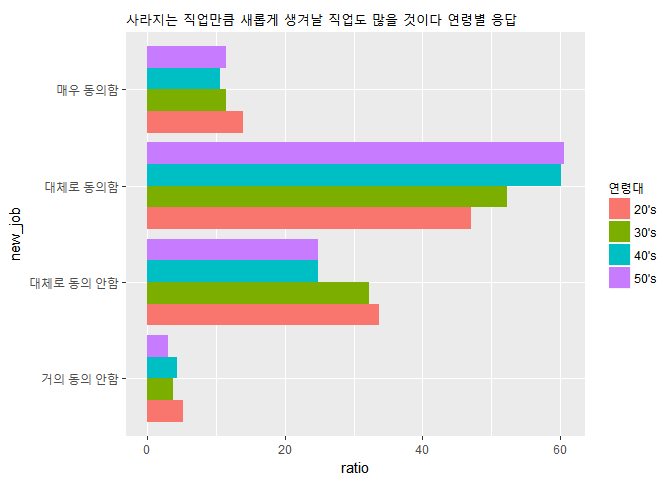

##### 미래기술로 인해 직업이 사라지는 만큼 새로운 일자리가 생길 것 같으냐는 질문에 대다수가 대체로 동의함을 밝혔다. 주목할 점은 새로운 일자리가 생긴다는 생각에 거의 동의하지 않는다는 의견에서 가장 많은 비율을 20대가 차지하고 있으며, 그와 정반대로 새로운 일자리가 생긴다는 것에 매우 동의하는 것에서 역시 가장 높은 비율을 차지하고 있다.

##### 5. 연령대에 따른 일자리에 대한 인공지능의 잠재적 영향력 인식도

``` r
#데이터 확인
df %>% group_by(n_ages, influence) %>%    #인공지능이 일자리에 미칠 잠재적 영향력
  summarise(count = n())
```

    ## # A tibble: 20 x 3
    ## # Groups:   n_ages [?]
    ##    n_ages influence                count
    ##    <chr>  <chr>                    <int>
    ##  1 20's   감소로 인한 폭동            75
    ##  2 20's   감소하나 적응              123
    ##  3 20's   궁극적 증가                  5
    ##  4 20's   단기적 감소, 장기적 증가    50
    ##  5 20's   모르겠다                    11
    ##  6 30's   감소로 인한 폭동            69
    ##  7 30's   감소하나 적응              126
    ##  8 30's   궁극적 증가                  6
    ##  9 30's   단기적 감소, 장기적 증가    40
    ## 10 30's   모르겠다                    19
    ## 11 40's   감소로 인한 폭동            60
    ## 12 40's   감소하나 적응              130
    ## 13 40's   궁극적 증가                  6
    ## 14 40's   단기적 감소, 장기적 증가    40
    ## 15 40's   모르겠다                    17
    ## 16 50's   감소로 인한 폭동            48
    ## 17 50's   감소하나 적응              141
    ## 18 50's   궁극적 증가                  7
    ## 19 50's   단기적 감소, 장기적 증가    61
    ## 20 50's   모르겠다                     4

``` r
# 데이터 가공
# 시각화 준비
df_influence <- df %>% group_by(n_ages, influence) %>%  
  summarise(count = n())%>% 
  mutate(ratio = count/sum(count)*100)

#데이터 시각화
ggplot(data = df_influence, aes(x=influence, y=ratio, fill = n_ages)) + 
  geom_col(position = "dodge") + 
  coord_flip() +
  scale_x_discrete(limits = c("궁극적 증가", "모르겠다", "단기적 감소, 장기적 증가","감소로 인한 폭동","감소하나 적응")) + 
  scale_fill_discrete(name="연령대")+
  ggtitle("인공지능이 일자리에 미치는 잠재적 영향 연령별 응답")
```

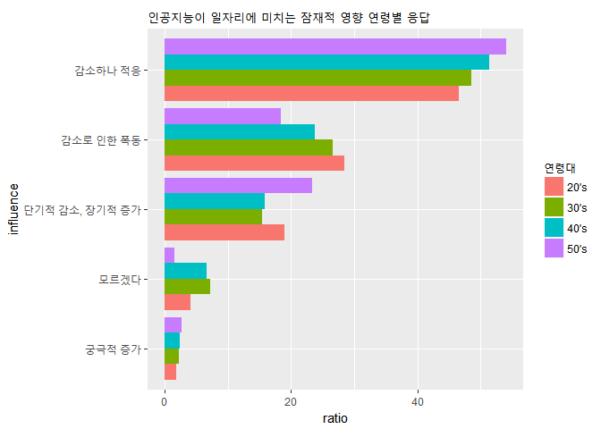

##### 설문에 응답한 대부분의 사람이 일자리 수는 감소하지만, 사회적으로 적응할 것이라는 대답을 꼽았다. 여기서 주목할 점은 장기적으로 일자리 수가 늘어난다는 것과 일자리 수가 궁극적으로 늘어난다는 식의 미래 기술에 대한 긍정적 대답에서의 비율이 50대가 가장 높았다는 것과 오히려 사회적 폭동이 우려된다는 부정적인 생각에서의 비율은 20대가 높다는 것이다

##### 앞서 말했듯이, 연령대가 낮을수록 미래기술에 대해서 평소 긍정적으로 생각하는 사람이 많았던 것에 비해서, 미래기술이 사회적 폭동을 일으킬 수도 있다는 생각 역시 젊은 층이 주로 많이 하고 있다는 것은 재미있는 사실이다.

#### 4-4. 직업에 따른 차이

##### 1. 직업별 인공지능 우호도

###### 1-1. 데이터 분석

###### 1-2. 직업별 인공지능 우호도 분석

``` r
# 데이터 가공
job_prefer <- df %>%
  group_by(job, prefer)%>%
  summarise(count=n())

job_prefer <- job_prefer %>% mutate(percent = count/sum(count)*100)


#데이터시각화
ggplot(job_prefer, aes(x = job, y = percent, fill = as.factor(prefer))) +
  geom_bar(stat = "identity")+
  theme(legend.position = "bottom")+
  scale_x_discrete(limits = c("관리자","전문가","사무직","서비스","판매직", ###직업변수에 이름 부여
                            "농림어업","기능원","기계장치","단순노무",
                            "학생","가정주부","무직"))+
  scale_fill_discrete(name = "로봇 선호도",                                 ###선호도에 이름부여   
                      labels = c("긍정적", "부정적")) +
  ggtitle("인공지능에 대한 직업별 우호도") + coord_flip()
```


##### 인공지능에 관하여 직업별로 우호 도를 조사한 분석 그래프의 결과 대부분 직업과 상관없이 부정적으로 생각하고 있다는 것을 알 수 있고, 그 중 관리자, 판매직, 농립어업, 기계장치 등의 경우는 긍정의 답변이 현저히 낮다는 것을 알 수 있다. 이는 AI를 통하여 대체될 수 있는 직업군 중 판매직, 농림어업, 관리자, 기계장치 부분에서 훨씬 인공지능에 대하여 부정적으로 인식되고 있다는 것을 알 수 있다. 실제로 한국직업능력개발원에서 4차 산업혁명에 따른 고위험 직업분석결과 판매직, 기계장치 부분이 가장 높은 위험에 처해있다는 분석과 위 그래프의 실제 직업을 가지고 있는 참여자들의 인공지능에 대한 우호도와 연결된다.

##### 2. 직업별 인공지능 위협도 인식 (인간의 일자리)

``` r
#직업별 로봇이 인간의 일자리를 빼앗을 것이다 설문응답 분석위해 그룹별 묶어 비율변수 추가
job_take_job <- df%>%
  group_by(job, take_job)%>%
  summarise(count=n())

job_take_job <- job_take_job %>%
  mutate(percent=count/sum(count)*100)

#데이터시각화
ggplot(job_take_job, aes(x = job, y = percent, fill = as.factor(take_job))) +
  geom_bar(stat = "identity") + theme(legend.position = "bottom")+
  scale_x_discrete(limits = c("관리자", "전문가", "사무직", "서비스", "판매직",  ###직업변수에 이름 부여
                              "농림어업", "기능원", "기계장치", "단순노무",
                              "학생", "가정주부", "무직"))+
  scale_fill_discrete(name = "일자리를 뺏긴다")+   ###동의여부에 이름부여
  ggtitle("'인간의 일자리를 빼앗을 것이다'라는 질문에 대한 직업별 응답")+
  coord_flip()
```


##### 직업별로 인공지능이 일자리를 빼앗을 것이라는 설문에 대한 그래프를 본다면 직업과 상관없이 일자리를 빼앗을 것이라는 질문에 대부분 동의하는 것으로 나타나고 있다. 여기서는 신기하게 단순노무, 기능 원, 농림어업, 기계장치 부분에서 동의하지 않는 비율이 상대적으로 다른 직업군보다 상대적으로 높은 편으로 나타난다. 단순노무, 기능 원, 기계장치 직업군은 한국직업능력개발원에 따른 고위험 직업군 종사자 비율부분에서 높은 순위를 차지한 결과와는 다르게 위 분석결과에서는 동의하지 않는 비율이 상대적으로 높게 나타났다는 것을 알 수 있습니다.

##### 3. 직업별 인공지능 위협도 인식 (본인의 일자리)

``` r
#데이터 가공

job_threat <- df%>%           
  group_by(job, threat_job)%>%                
  summarise(count = n())
                                             #그룹별 묶어 비율변수 추가
job_threat <- job_threat %>%
  mutate(percent = count/sum(count)*100)

#데이터 시각화
ggplot(job_threat, aes(x = job, y = percent, fill = as.factor(threat_job))) +
  geom_bar(stat = "identity")+
  theme(legend.position = "bottom")+
  scale_x_discrete(limits = c("관리자", "전문가", "사무직", "서비스", "판매직",  ###직업변수에 이름 부여
                              "농림어업", "기능원", "기계장치", "단순노무",
                              "학생", "가정주부", "무직"))+ 
  scale_fill_discrete(name = "자신의 직업에 위협")+      ###동의여부에 이름부여
  coord_flip()+
  ggtitle("내가 현재 하고 있는 일은 위협을 받지 않을 것이다 직업별 응답")
```

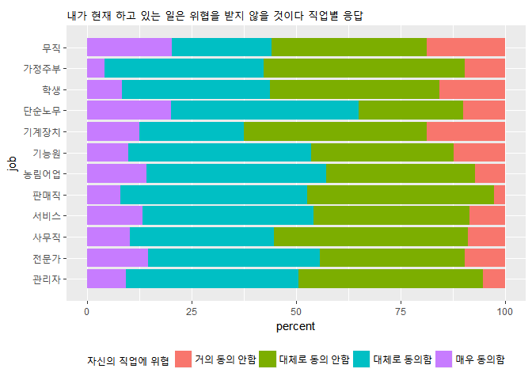

##### 앞의 분석과 연결되는 분석으로 '현재 자신의 직업은 위협을 받지 않을 것이다'라는 설문에 대한 분석결과를 보면 기계장치, 사무직, 가정주부의 직업군들이 상대적으로 위협받을 것 같다는 비율이 높다는 것을 알 수 있다. 이 분석결과는 다음 연구결과와 연결된다는 것을 알 수 있다. 미국의 경우 70년대부터 꾸준히 산업용 로봇이 증가해 현재 약 175만대 산업용 로봇이 가동 중이다. Bofa 메릴 린치 조사에 따르면 이 기간에 미국 제조업 일자리는 약 1천만 개 가까이 줄었다고 한다. 즉 산업용 기계의 증가로 인하여 기계장치 직업군이 대체되고 있다는 것을 알 수 있다. 또한 단순노동인 사무직의 경우도 고위험 직업군 비율이 높다는 것과 연결되며, 가정주부의 경우 집안일을 대신해주는 인공지능 청소기, 냉장고 등이 개발되는 것과 상충되는 분석이라는 것을 알 수 있다.

``` r
#일자리가 사라지는 대신 새로운 일자리가 생길 것이다 설문응답 분석위해 그룹별 묶어 비율변수 추가

job_new_job<- df%>%
  group_by(job,new_job)%>%
  summarise(count=n())

job_new_job <- job_new_job%>%mutate(percent=count/sum(count)*100)

#데이터 시각화

ggplot(job_new_job, aes(x=job,y=percent, fill=as.factor(new_job))) +
  geom_bar(stat = "identity")+
  theme(legend.position = "bottom")+
  scale_x_discrete(limits=c("관리자","전문가","사무직","서비스","판매직",   ###직업변수에 이름 부여
                            "농림어업","기능원","기계장치","단순노무",
                            "학생","가정주부","무직"))+
  scale_fill_discrete(name="새로운 일자리 생김")+                           ###동의여부에 이름부여
  ggtitle("일자리가 사라지는 대신 새로운 일자리가 생길 것이다 직업별 응답")+
  coord_flip()
```

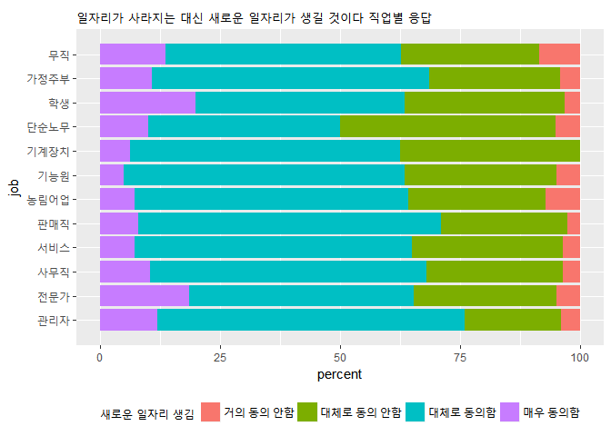

##### 직업별 일자리가 사라지는 대신 새로운 일자리가 생길 것이라는 분석결과 직업과는 상관없이 대부분 동의하는 비율이 높게 나타난다는 것을 알 수 있다. 이는 최근 세계경제포럼 보고서에서 2020년까지 로봇으로 인해 약 700만 개의 일자리가 사라지고 약 200만 개의 일자리가 새로 생길 것으로 전망과는 별개로 설문 참여자들은 로봇 등 신기술로 인한 새로운 기회에 대해 긍정적 인식을 하고 있음을 알 수 있다. 그러나 단순노무 직업군의 경우 동의하지 않는 비율이 상대적으로 훨씬 높게 나왔다는 것을 알 수 있는데, 다른 직업군들보다 인공지능이 단순노무 직업군에 있어서는 새로운 일자리가 생기기 어렵다는 인식을 가지고 있다는 분석을 할 수 있다.

##### 5. 직업별 일자리에 대한 인공지능의 잠재적 영향력

``` r
#데이터 가공
job_influence <- df%>%
  group_by(job, influence)%>%
  summarise(count = n())
                                      # 그룹별 묶어 비율변수 추가
job_influence <- job_influence %>%
  mutate(percent = count/sum(count)*100)

#데이터시각화
ggplot(job_influence, aes(x = job, y = percent, fill = as.factor(influence))) +
  geom_bar(stat = "identity") + theme(legend.position = "bottom")+
  scale_x_discrete(limits = c("관리자", "전문가", "사무직", "서비스", "판매직",   ###직업변수에 이름 부여
                              "농림어업", "기능원", "기계장치", "단순노무",
                              "학생", "가정주부", "무직"))+
  scale_fill_discrete(name="영향 정도")+
  ggtitle("'인공지능이 일자리에 미치는 잠재적 영향'이라는 질문에 대한 직업별 응답") + 
  coord_flip()
```

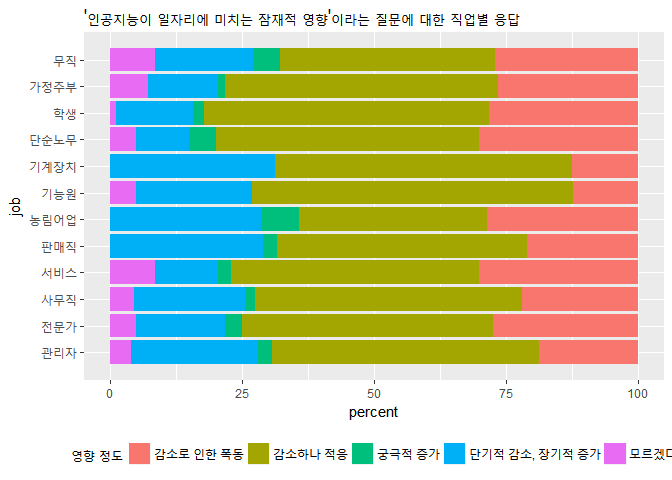

##### 직업별 인공지능이 일자리에 미치는 전망에 대한 분석결과를 본다면 궁극적으로 증가할 것이라는 응답은 직업군 모두 현저히 낮게 나타난다는 것을 알 수 있으며, 대부분 감소하나 적응될 것이라는 응답이 가장 높게 나타났다. 이는 앞의 일자리가 사라지는 대신 일자리가 새로 생길 것이다 설문에서 긍정적인 응답비율이 높게 나왔다는 것과 다르게 감소하나 적응, 감소로 인한 폭동 등의 부정적인 응답비율이 직업과는 상관없이 높게 나타났다는 것을 알 수 있다. 특히 단순노무나 서비스의 직업군에서 부정적인 응답비율이 높게 나타난다는 것을 알 수 있다.

#### 4-5. 소득에 따른 차이

##### 1. 소득별 인공지능 우호도

``` r
# 데이터 가공
wealth_prefer <- df %>% 
  group_by(income, prefer) %>%
  summarise(n = n()) 


# 전체 소득구간에서 인공지능에 다소 부정적/ 매우 부정적임을 알 수 있다.

wealth_prefer <- wealth_prefer %>% mutate(ratio = n/sum(n)*100)

summary(wealth_prefer)
```

    ##      income        prefer                n              ratio       
    ##  Min.   :1.00   Length:16          Min.   :  4.00   Min.   : 9.333  
    ##  1st Qu.:2.75   Class :character   1st Qu.: 22.25   1st Qu.:13.924  
    ##  Median :4.50   Mode  :character   Median : 33.00   Median :50.000  
    ##  Mean   :4.50                      Mean   : 64.88   Mean   :50.000  
    ##  3rd Qu.:6.25                      3rd Qu.:109.50   3rd Qu.:86.076  
    ##  Max.   :8.00                      Max.   :178.00   Max.   :90.667

``` r
# 데이터 시각화
ggplot(data = wealth_prefer, aes(x = income,
                     y = ratio,
                     fill = prefer)) + geom_col() + coord_flip() +
  scale_x_discrete(limits = c("under_200", "200~300", "300~400", "400~500", "500~600", "600~700", "700~800", "upper 800"))+
  ggtitle("인공지능에 대한 소득별 우호도")
```

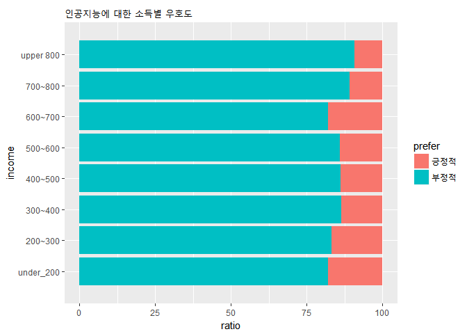

##### 각 소득 분위를 기준으로 인공지능에 대해 긍정인지 부정인지 물어보는 대답에 대한 비율이다.

###### 긍정의 답변보다는 부정의 답변 비율이 압도적인 것으로 분석 되었다. 또한, 고소득층으로 갈수록 긍정의 비율이 줄어드는 것으로 나타났다.

##### 2. 소득별 인공지능 위협도 인식 (인간의 일자리)

``` r
# 데이터 가공
wealth_take_job <- df%>% 
  group_by(income, take_job) %>%
  summarise(n = n())

wealth_take_job <- wealth_take_job %>% mutate(ratio = n/sum(n)*100)

#데이터 시각화
ggplot(data = wealth_take_job, aes(x = income,
                      y = ratio,
                      fill = take_job)) + geom_col() + coord_flip() +
  scale_x_discrete(limits = c("under_200", "200~300", "300~400", "400~500", "500~600", "600~700", "700~800", "upper 800"))+
  theme(legend.position = "bottom")+
  ggtitle("'인간의 일자리를 빼앗을 것이다'이라는 질문에 대한 소득별 응답")
```

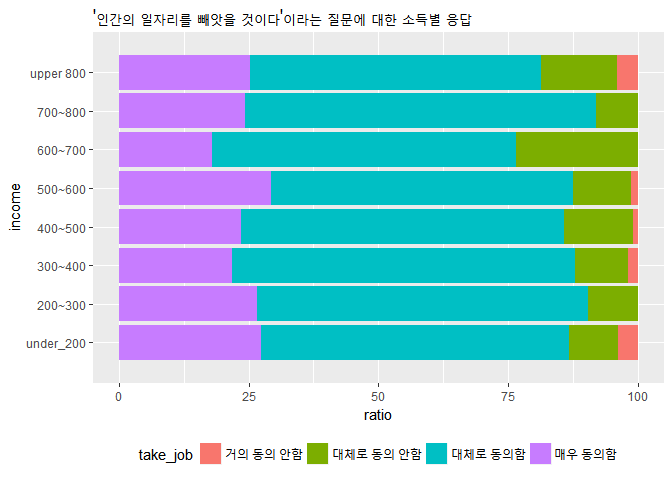

##### 모든 소득층에서 인공지능이 인간의 일자리를 빼앗을 것에 대해 동의한다고 대답한 비율이 높은 것으로 분석되었다.

##### 3. 소득별 인공지능 위협도 인식 (본인의 일자리)

``` r
# 데이터 가공
wealth_threat <- df%>% 
  group_by(income, threat_job) %>%
  summarise(n = n())

wealth_threat <- wealth_threat %>% mutate(ratio = n/sum(n)*100)

#데이터 시각화
ggplot(data = wealth_threat, aes(x = income,
                      y = ratio,
                      fill = threat_job)) +
  geom_col() +
  coord_flip() +
  scale_x_discrete(limits = c("under_200", "200~300", "300~400", "400~500", "500~600", "600~700", "700~800", "upper 800"))+
  theme(legend.position = "bottom")+
  ggtitle("내가 현재 하고 있는 일은 위협을 받지 않을 것이다 소득별 응답")
```

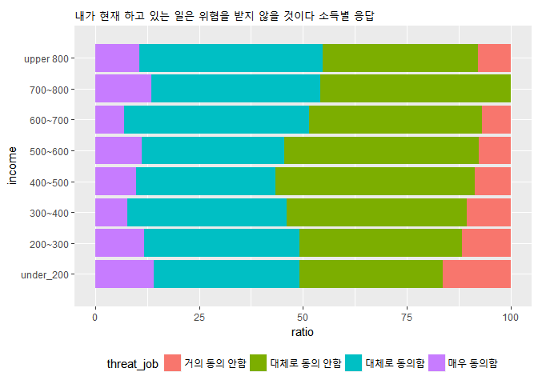

##### 소득 집단에서 반수가 넘는 사람들이 위협 받을 거로 생각하는 것으로 분석되었다. 세부적으로 살펴보면, 저소득층으로 갈수록 인공지능이 자신의 일자리를 위협할 것이라고 대답한 빈도가 높아진다.

##### 4. 소득별 인공지능의 새로운 일자리 창출에 대한 인식

``` r
# 데이터 가공
wealth_new_job <- df %>% 
  group_by(income, new_job) %>%
  summarise(n = n())

wealth_new_job <- wealth_new_job %>% mutate(ratio = n/sum(n)*100)

#데이터 시각화
ggplot(data = wealth_new_job, aes(x = income,
                      y = ratio,
                      fill = new_job)) + geom_col() + coord_flip() +
  scale_x_discrete(limits = c("under_200", "200~300", "300~400", "400~500", "500~600", "600~700", "700~800", "upper 800"))+
  theme(legend.position = "bottom")+
  ggtitle("사라지는 직업만큼 새롭게 생겨날 직업도 많을 것이다 소득별 응답")
```

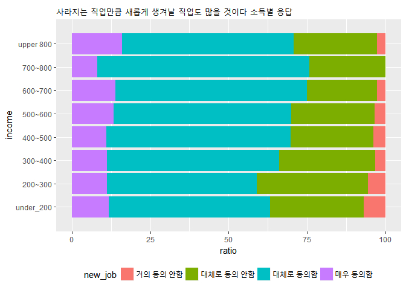

##### 대부분의 사람이 새로운 직업이 생겨날 것이라고 동의하였다.

##### 5. 소득별 인공지능의 발달로 인한 인식

``` r
# 통합 그래프로 한눈에 보기

g1 = ggplot(data = wealth_take_job, aes(x = income,
                           y = ratio,
                           fill = take_job)) + geom_col() + coord_flip() +
  scale_x_discrete(limits = c("under_200", "200~300", "300~400", "400~500", "500~600", "600~700", "700~800", "upper 800"))+
  ggtitle("'인간의 일자리를 빼앗을 것이다'이라는 질문에 대한 소득별 응답")

g2 = ggplot(data = wealth_threat, aes(x = income,
                           y = ratio,
                           fill = threat_job)) + geom_col() + coord_flip() +
  scale_x_discrete(limits = c("under_200", "200~300", "300~400", "400~500", "500~600", "600~700", "700~800", "upper 800"))+
  ggtitle("'나의 일은 위협을 받지 않을 것이다'이라는 질문에 대한 소득별 응답")

g3 = ggplot(data = wealth_new_job, aes(x = income,
                           y = ratio,
                           fill = new_job)) + geom_col() + coord_flip() +
  scale_x_discrete(limits = c("under_200", "200~300", "300~400", "400~500", "500~600", "600~700", "700~800", "upper 800"))+
  ggtitle("새롭게 생겨날 직업도 많을 것이다 소득별 응답")

#그래프 합치기
grid.arrange(g1,g2,g3, ncol=1, nrow=3)
```

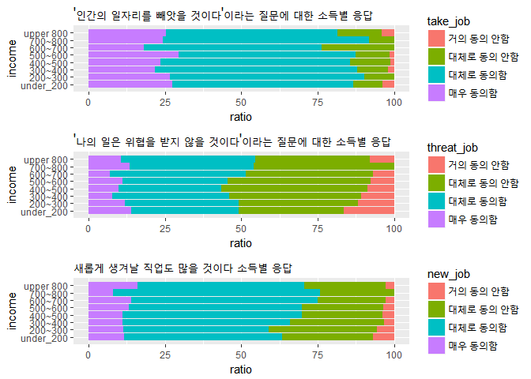

##### 6. 소득별 일자리에 대한 인공지능의 잠재적 영향력 인식도

``` r
# 데이터 가공

wealth_influence <- df %>% group_by(income, influence) %>% 
  summarise(n=n()) %>% 
  mutate(ratio = n/sum(n)*100)

wealth_influence$wealth <- ifelse(wealth_influence$income < 3, "low", ifelse(wealth_influence$income < 7, "middle", "high"))
                                                
# 데이터 시각화
ggplot(data = wealth_influence, aes(x = influence, y = ratio , fill = wealth)) + 
  geom_col(position = "dodge") + 
  scale_fill_discrete(name="소득수준")+
  ggtitle("인공지능이 일자리에 미치는 잠재적 영향 소득별 응답")+
  coord_flip()
```

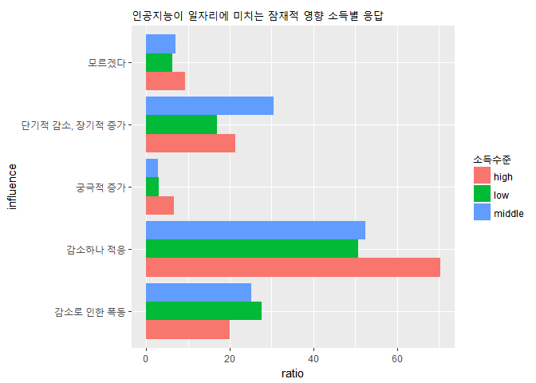

##### 모든 소득층에서 인공지능으로 인해 인간의 일자리가 감소하지만, 사회적으로 적응할 것이라고 대답한 빈도가 높은 것으로 분석되었다. 특히 상대적으로 고소득층이 적응할 것이라고 답한 비율이 저소득층보다 높았다.

5. 결론
-------

#### 5-1. 조사결과 종합

#### 4차산업혁명을 맞이하면서 인공지능의 보편화가 진행 중이며, 판매직, 단순노무, 기계장치의 직업군은 4차 산업혁명의 더욱 큰 위협을 받고 있는 현실이다. 이런 현실 속에서 일자리에 대한 국민들의 표본인 1038명의 설문응답 데이터를 통하여 인공지능에 대한 우호도, 일자리 전망, 로봇이 일자리를 빼앗을 것이다 등의 설문 분석결과를 통해서도 알 수 있듯이 종합적으로 국민들은 인공지능에 대해 과반수가 부정적으로 인식하는 것으로 모든 변수에 따라 차이 없이 나타났다. 하지만 본인의 직업이 인공지능에 빼앗길것이라는 항목면에서, 직업 변수는 긍정의 비율이 높지만 소득면에서 봤을때에는 긍정과 부정의 비율이 거의 반반이라는 결과가 나왔다. 따라서 인공지능과 일자리에 관련해서는 직종이 어느것이냐 보다는 소득이 얼마이냐가 더 큰 요소로 작용된다고 볼 수 있다. 또한, 남성이 인공지능에 대해 부정적으로 인식하는 것이 여성보다 높았는데, 이를 직업별 분석에서 육체적 노동을 하는 장치, 기계조작 및 조립 종사자는 상대적으로 자신의 직업이 위협당할 것으로 인식한 결과와 종합해보면, 남성이 여성보다 육체적노동에 종사하는 경우가 높기 때문에 이러한 결과가 분석된 것으로 추론할 있다. 모든 변수에서 인공지능에 따른 인간의 일자리 위협에 대해선 동의하지만, 자신의 일자리 위협에 대해선 동의하지 않은 것으로 나타났다. 이는 국민들은 기술 발전으로 인해 일자리가 사라질 수는 있지만 근본적으로 창조력이나 상상력이 요구되는 인간 고유의 행위 혹은 일자리는 대체할 수 없을 것이라는 생각을 갖고 있다고 추론할 수 있다. 즉, 인공지능, 로봇 등 신기술의 일상화에 대해 일자리에 대한 위협으로 받아들이기보다는 오히려 그것이 가져다 줄 수 있는 어떤 새로운 혜택에 대한 기대감을 나타내고 있다고도 분석할 수 있다. 또한, 인공지능으로 인한 새로운 일자리 창출에 대해 동의하며, 인공지능이 인간의 일자리에 대한 잠재적 영향력에 대해 일자리 수가 감소하지만, 적응할 것이라는 대답을 한 것으로 분석되었다. 이는 국민들은 로봇 등 신기술로 인한 새로운 기회에 대해 긍정적으로 인식하고 있음을 알 수 있다. 또한, 국민들이 인공지능이 지식 서비스업보다는 사람의 육체적 노동이 필요한 직업을 우선으로 대체할 것으로 전망하고 있다는 점에서 우리가 앞으로 인공지능에게 일자리를 위협받지 않기 위해선 전문직과 서비스직에 초점을 맞춰 일자리를 대비해야 할 것이다.

#### 5-2. 한계점, 추가 분석 방향 제시

#### 직업별 분석 결과 무직인 경우나 학생의 경우 과연 일자리에 대한 설문 응답이 의미가 있는 분석인지 의문이 드는 것이 사실이며, 무직인 경우나, 학생의 경우 또한 하나의 직업이라고 생각하는 경우도 있듯이 빼고 분석한다는 것은 분석결과에 대하여 결측치가 많아지므로 한계점이 더 많아질 것이다. 따라서 이 한계점을 보완하기 위해서는 무직이나 학생의 경우 자신이 원하는 직업군으로 생각해서 설문한 결과에는 의미가 있지만 이 설문지의 경우 원하는 직장이 무엇인지 모르기 때문에 무직이나, 학생의 경우 원하는 직업군을 선택하여 응답할 수 있도록 설문지에 적혀 있었다면 조금 더 유의미한 설문지에 대한 응답이 될 수 있다. 또한 성별, 직업별, 연령별, 소득별, 지역별 분석으로 나누어 분석했기 때문에 개별 분석을 통하여 분석결과를 도출해내는 한계점이 있다. 이를 보완하려면 두 개나 세 개의 분석을 통틀어서 로봇이 일자리에 대한 인식 분석을 추가한다면 극복할 수 있다.
